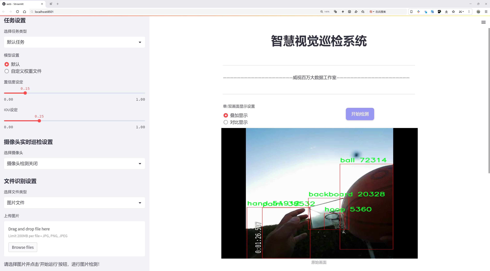
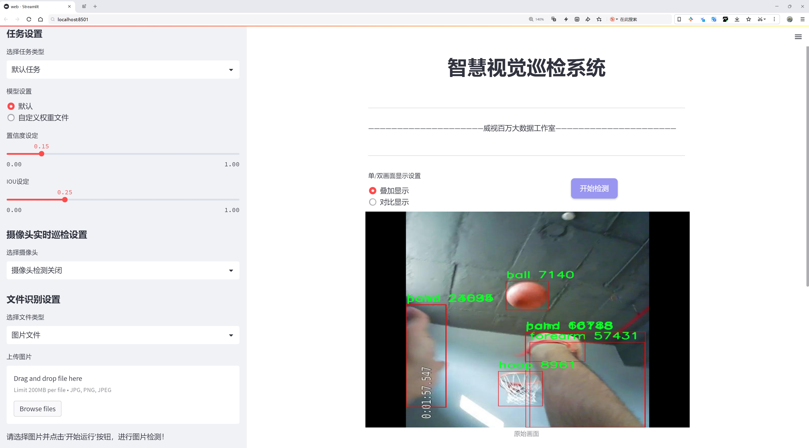
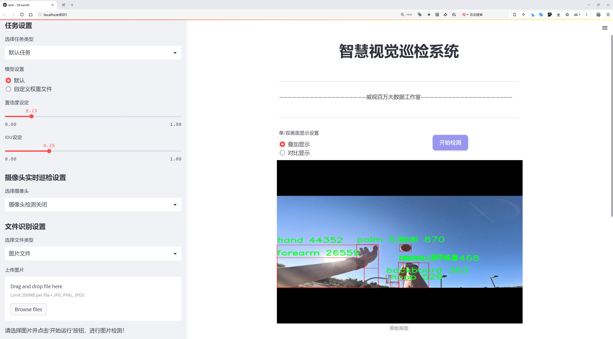
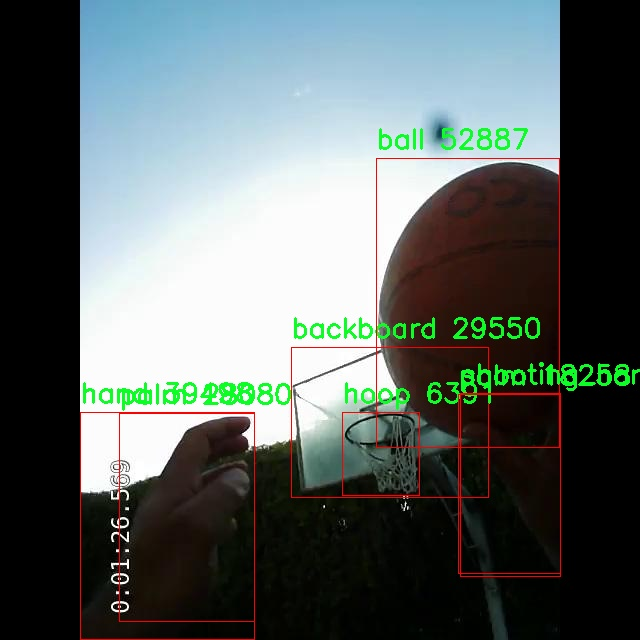
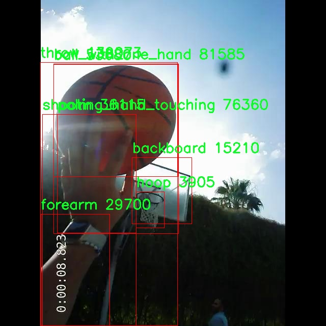
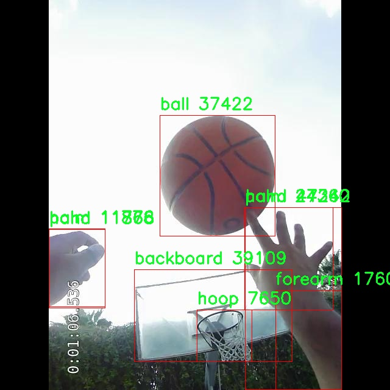
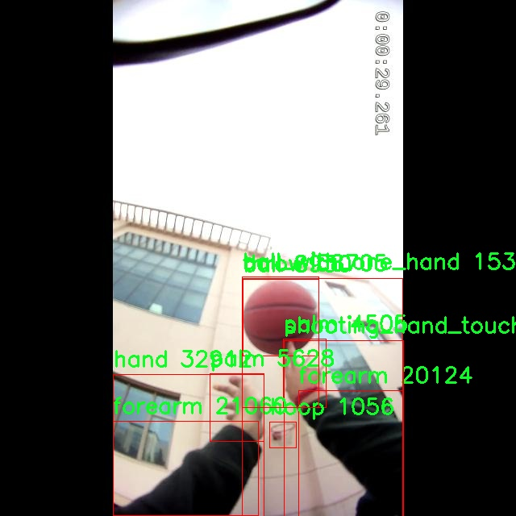
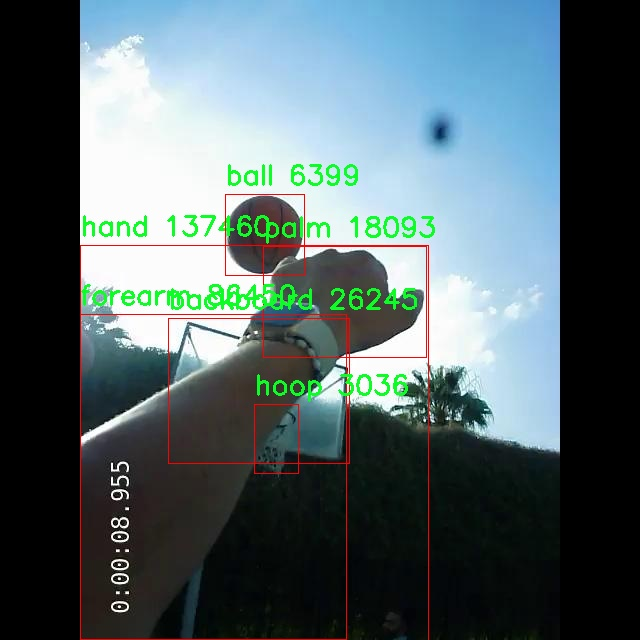

# 投篮动作识别检测系统源码分享
 # [一条龙教学YOLOV8标注好的数据集一键训练_70+全套改进创新点发刊_Web前端展示]

### 1.研究背景与意义

项目参考[AAAI Association for the Advancement of Artificial Intelligence](https://gitee.com/qunmasj/projects)

项目来源[AACV Association for the Advancement of Computer Vision](https://kdocs.cn/l/cszuIiCKVNis)

研究背景与意义

在现代体育科学与技术迅速发展的背景下，运动员的训练与比赛表现越来越依赖于数据分析与智能技术的应用。篮球作为一项全球广受欢迎的运动，其技术动作的精确性与有效性直接影响到比赛的结果。投篮动作作为篮球比赛中最为关键的技术之一，准确识别和分析投篮动作不仅能够帮助教练制定更为科学的训练计划，还能为运动员提供及时的反馈，从而提高其投篮命中率。因此，基于计算机视觉技术的投篮动作识别系统的研究具有重要的理论价值与实际意义。

YOLO（You Only Look Once）系列模型因其高效的实时目标检测能力而广泛应用于各种视觉识别任务。YOLOv8作为该系列的最新版本，具备更强的特征提取能力和更快的处理速度，适合于复杂场景下的动作识别任务。通过对YOLOv8进行改进，结合特定的篮球投篮动作数据集，可以进一步提升系统的识别精度与实时性。该数据集包含1600张图像，涵盖了12个类别，包括“backboard”、“ball”、“ball_with_one_hand”、“ball_with_two_hands”等，能够全面反映投篮过程中的各个关键动作。这为我们构建一个高效的投篮动作识别系统提供了丰富的基础数据。

在当前的研究中，投篮动作的识别不仅仅局限于对投篮过程的简单检测，更需要深入分析各个动作之间的关系及其对投篮效果的影响。通过改进YOLOv8模型，我们可以实现对不同投篮动作的精准识别，从而为后续的动作分析提供数据支持。这一系统的实现将有助于教练员和运动员在训练中更好地理解投篮动作的细节，识别出影响投篮效果的关键因素，进而优化训练方案。

此外，投篮动作识别系统的研究也具有广泛的应用前景。除了在篮球训练与比赛中的应用外，该系统还可以扩展到其他球类运动的动作识别中，形成一个通用的运动动作分析平台。通过对不同运动项目的动作识别与分析，可以为运动员提供个性化的训练指导，提升其整体竞技水平。同时，该系统也为运动科学研究提供了新的数据来源，有助于推动运动生物力学、运动心理学等领域的深入研究。

综上所述，基于改进YOLOv8的投篮动作识别系统的研究，不仅能够提升篮球运动的训练与比赛水平，还能为相关领域的研究提供重要的理论与实践支持。这一研究的开展，将为推动智能体育技术的发展贡献一份力量，具有重要的学术价值与实际应用意义。

### 2.图片演示







##### 注意：由于此博客编辑较早，上面“2.图片演示”和“3.视频演示”展示的系统图片或者视频可能为老版本，新版本在老版本的基础上升级如下：（实际效果以升级的新版本为准）

  （1）适配了YOLOV8的“目标检测”模型和“实例分割”模型，通过加载相应的权重（.pt）文件即可自适应加载模型。

  （2）支持“图片识别”、“视频识别”、“摄像头实时识别”三种识别模式。

  （3）支持“图片识别”、“视频识别”、“摄像头实时识别”三种识别结果保存导出，解决手动导出（容易卡顿出现爆内存）存在的问题，识别完自动保存结果并导出到tempDir中。

  （4）支持Web前端系统中的标题、背景图等自定义修改，后面提供修改教程。

  另外本项目提供训练的数据集和训练教程,暂不提供权重文件（best.pt）,需要您按照教程进行训练后实现图片演示和Web前端界面演示的效果。

### 3.视频演示

[3.1 视频演示](https://www.bilibili.com/video/BV1nTsZeDEV2/)

### 4.数据集信息展示

##### 4.1 本项目数据集详细数据（类别数＆类别名）

nc: 12
names: ['backboard', 'ball', 'ball_with_one_hand', 'ball_with_two_hands', 'forearm', 'hand', 'hoop', 'non_shooting_hand_touching', 'off_hand', 'palm', 'shooting_hand_touching', 'throw']


##### 4.2 本项目数据集信息介绍

数据集信息展示

在本研究中，我们采用了名为“1207_dishith_anant_akshita”的数据集，以改进YOLOv8的投篮动作识别系统。该数据集的设计旨在为投篮动作的识别提供丰富的样本和多样化的类别信息，进而提升模型在实际应用中的准确性和鲁棒性。数据集包含12个类别，具体包括：backboard（篮板）、ball（篮球）、ball_with_one_hand（单手持球）、ball_with_two_hands（双手持球）、forearm（前臂）、hand（手）、hoop（篮筐）、non_shooting_hand_touching（非投篮手接触）、off_hand（辅助手）、palm（手掌）、shooting_hand_touching（投篮手接触）以及throw（投掷动作）。这些类别涵盖了投篮动作的各个方面，确保了数据集的全面性和多样性。

数据集的构建过程注重真实场景的模拟，确保每个类别的样本都能够在不同的环境和条件下被有效捕捉。比如，在“ball_with_one_hand”和“ball_with_two_hands”这两个类别中，数据集提供了不同角度和姿势下的持球动作，帮助模型学习如何区分单手和双手持球的细微差别。此外，针对“shooting_hand_touching”和“non_shooting_hand_touching”这两个类别，数据集收录了多种投篮姿势和手部动作的样本，使得模型能够更好地理解投篮时手部的动态变化。

为了增强数据集的实用性和适应性，样本的收集不仅限于专业运动员，还包括业余爱好者和不同年龄段的参与者。这种多样化的样本来源使得模型在面对不同技能水平的投篮动作时，能够保持较高的识别准确率。同时，数据集还考虑到了不同的拍摄条件，如光照变化、背景杂乱等，确保模型在实际应用中能够应对各种复杂情况。

在数据集的标注过程中，采用了严格的标注标准，确保每个样本的类别标签准确无误。标注团队经过专业培训，能够识别和区分各类投篮动作及其相关的手部动作。这种高质量的标注为后续的模型训练提供了坚实的基础，使得YOLOv8在投篮动作识别任务中能够发挥出色的性能。

通过对“1207_dishith_anant_akshita”数据集的深入分析和应用，我们期望能够显著提升YOLOv8在投篮动作识别方面的表现。数据集的丰富性和多样性不仅为模型提供了广泛的学习素材，也为未来的研究提供了良好的基础。随着模型的不断优化和迭代，我们相信这一数据集将为投篮动作识别领域带来新的突破和进展，推动相关技术的进一步发展。











### 5.全套项目环境部署视频教程（零基础手把手教学）

[5.1 环境部署教程链接（零基础手把手教学）](https://www.ixigua.com/7404473917358506534?logTag=c807d0cbc21c0ef59de5)


[5.2 安装Python虚拟环境创建和依赖库安装视频教程链接（零基础手把手教学）](https://www.ixigua.com/7404474678003106304?logTag=1f1041108cd1f708b01a)

### 6.手把手YOLOV8训练视频教程（零基础小白有手就能学会）

[6.1 手把手YOLOV8训练视频教程（零基础小白有手就能学会）](https://www.ixigua.com/7404477157818401292?logTag=d31a2dfd1983c9668658)

### 7.70+种全套YOLOV8创新点代码加载调参视频教程（一键加载写好的改进模型的配置文件）

[7.1 70+种全套YOLOV8创新点代码加载调参视频教程（一键加载写好的改进模型的配置文件）](https://www.ixigua.com/7404478314661806627?logTag=29066f8288e3f4eea3a4)

### 8.70+种全套YOLOV8创新点原理讲解（非科班也可以轻松写刊发刊，V10版本正在科研待更新）

由于篇幅限制，每个创新点的具体原理讲解就不一一展开，具体见下列网址中的创新点对应子项目的技术原理博客网址【Blog】：


[8.1 70+种全套YOLOV8创新点原理讲解链接](https://gitee.com/qunmasj/good)

### 9.系统功能展示（检测对象为举例，实际内容以本项目数据集为准）

图9.1.系统支持检测结果表格显示

  图9.2.系统支持置信度和IOU阈值手动调节

  图9.3.系统支持自定义加载权重文件best.pt(需要你通过步骤5中训练获得)

  图9.4.系统支持摄像头实时识别

  图9.5.系统支持图片识别

  图9.6.系统支持视频识别

  图9.7.系统支持识别结果文件自动保存

  图9.8.系统支持Excel导出检测结果数据


### 10.原始YOLOV8算法原理

原始YOLOv8算法原理

YOLOv8算法是YOLO系列目标检测算法的最新版本，继承并优化了前几代模型的设计理念，进一步提升了检测精度和速度。YOLO（You Only Look Once）作为一种经典的一阶段目标检测算法，首次将目标检测任务转化为回归问题，通过单一神经网络模型同时预测目标的位置和类别。YOLOv8在此基础上进行了多项创新，形成了一个更加高效和灵活的目标检测框架。

YOLOv8的网络结构主要由三个部分组成：主干网络（Backbone）、特征增强网络（Neck）和检测头（Head）。主干网络采用了CSP（Cross Stage Partial）思想，旨在通过分段处理来增强特征提取的能力。具体而言，YOLOv8使用了CSPDarknet结构，这一结构通过将输入特征图分为两个分支并分别进行处理，能够有效地保留更多的梯度流信息，提升模型的学习能力。相较于前代模型，YOLOv8在特征提取模块中引入了C2f模块，替代了C3模块，进一步增强了特征的表达能力，并且在通道数的调整上进行了优化，以适应不同尺度的目标。

在特征增强网络部分，YOLOv8采用了PAN-FPN（Path Aggregation Network with Feature Pyramid Network）的结合，利用特征金字塔和路径聚合的结构，促进了语义信息和定位信息的有效融合。这种设计使得网络能够更好地处理不同尺度的目标，提高了对小目标和大目标的检测性能。通过这种多层次特征融合，YOLOv8能够在复杂场景中更准确地定位目标，并且提升了对背景干扰的抵抗能力。

检测头部分是YOLOv8的一大创新之处。与以往的耦合头不同，YOLOv8采用了解耦头结构，将分类和回归任务分为两个独立的分支。这样的设计使得模型在处理复杂场景时，能够更加专注于各自的任务，从而有效地解决了定位不准和分类错误的问题。通过解耦，YOLOv8在训练过程中能够更快地收敛，提高了整体的检测效率。

值得一提的是，YOLOv8引入了Anchor-free目标检测方法，这一方法不再依赖于预先定义的锚点框，而是直接通过回归方式预测目标的位置和大小。这一创新使得YOLOv8能够更灵活地适应不同形状和尺度的目标，避免了传统方法中锚点框选择和调整的繁琐过程。通过这种Anchor-free的设计，YOLOv8能够更快地聚焦于目标位置的邻近点，使得预测框更接近于实际的边界框区域，从而提高了检测的准确性。

在训练过程中，YOLOv8还采用了更复杂的损失函数，以进一步提升模型的训练效果。通过对不同任务的损失进行加权，YOLOv8能够更好地平衡分类和回归的目标，从而在实际应用中实现更高的检测精度。同时，YOLOv8的模型权重文件相较于之前的版本进行了轻量化处理，使得其能够在嵌入式设备上高效运行，满足实时检测的需求。

YOLOv8的输入部分对图像进行预处理，包括调整图像比例、实现Mosaic增强和瞄点计算等。这些预处理步骤不仅提升了模型的鲁棒性，还为后续的特征提取和目标检测打下了良好的基础。通过这些创新，YOLOv8在保持高效性的同时，进一步提升了目标检测的精度和速度。

总的来说，YOLOv8算法通过引入一系列创新的设计理念和技术，形成了一个高效、灵活且准确的目标检测框架。其在特征提取、特征融合和目标检测等多个方面的优化，使得YOLOv8在实际应用中表现出色，能够满足多种复杂场景下的目标检测需求。随着YOLOv8的广泛应用，目标检测技术将迎来新的发展机遇，推动计算机视觉领域的进一步进步。


### 11.项目核心源码讲解（再也不用担心看不懂代码逻辑）

#### 11.1 ui.py

以下是代码的核心部分，并添加了详细的中文注释：

```python
import sys  # 导入系统模块，用于获取当前 Python 解释器的路径
import subprocess  # 导入子进程模块，用于执行外部命令
from QtFusion.path import abs_path  # 从 QtFusion.path 导入 abs_path 函数，用于获取绝对路径

def run_script(script_path):
    """
    使用当前 Python 环境运行指定的脚本。

    Args:
        script_path (str): 要运行的脚本路径

    Returns:
        None
    """
    # 获取当前 Python 解释器的路径
    python_path = sys.executable

    # 构建运行命令，使用 streamlit 运行指定的脚本
    command = f'"{python_path}" -m streamlit run "{script_path}"'

    # 执行命令，并等待其完成
    result = subprocess.run(command, shell=True)
    
    # 检查命令执行的返回码，如果不为0则表示出错
    if result.returncode != 0:
        print("脚本运行出错。")

# 实例化并运行应用
if __name__ == "__main__":
    # 指定要运行的脚本路径，这里使用 abs_path 函数获取绝对路径
    script_path = abs_path("web.py")

    # 调用 run_script 函数运行指定的脚本
    run_script(script_path)
```

### 代码分析：
1. **模块导入**：
   - `sys`模块用于获取当前 Python 解释器的路径。
   - `subprocess`模块用于执行外部命令，这里用来运行 Python 脚本。
   - `abs_path`函数用于获取指定文件的绝对路径。

2. **`run_script`函数**：
   - 该函数接受一个脚本路径作为参数，并使用当前 Python 环境运行该脚本。
   - 通过`sys.executable`获取当前 Python 解释器的路径。
   - 构建一个命令字符串，使用`streamlit`运行指定的脚本。
   - 使用`subprocess.run`执行命令，并检查返回码以确定脚本是否成功运行。

3. **主程序入口**：
   - 使用`if __name__ == "__main__":`确保该代码块仅在直接运行脚本时执行。
   - 指定要运行的脚本路径，并调用`run_script`函数来执行该脚本。

这个程序文件名为 `ui.py`，其主要功能是运行一个指定的 Python 脚本，具体是通过 Streamlit 框架来启动一个 Web 应用。

首先，文件中导入了一些必要的模块，包括 `sys`、`os` 和 `subprocess`。`sys` 模块用于访问与 Python 解释器相关的变量和函数，`os` 模块提供了与操作系统交互的功能，而 `subprocess` 模块则用于生成新的进程、连接到它们的输入/输出/错误管道，并获取它们的返回码。

接下来，程序定义了一个名为 `run_script` 的函数，该函数接受一个参数 `script_path`，表示要运行的脚本的路径。在函数内部，首先获取当前 Python 解释器的路径，这通过 `sys.executable` 实现。然后，构建一个命令字符串，该命令使用当前的 Python 解释器来运行指定的脚本，具体是通过 `streamlit run` 命令来启动 Streamlit 应用。

使用 `subprocess.run` 方法执行构建好的命令，并设置 `shell=True` 以便在 shell 中运行该命令。执行后，程序检查返回码，如果返回码不为零，表示脚本运行过程中出现了错误，此时会打印出“脚本运行出错。”的提示信息。

在文件的最后部分，使用 `if __name__ == "__main__":` 语句来确保只有在直接运行该脚本时才会执行后面的代码。在这里，指定了要运行的脚本路径，调用 `abs_path` 函数获取 `web.py` 的绝对路径，然后调用 `run_script` 函数来执行这个脚本。

总的来说，这个文件的作用是通过 Streamlit 框架来启动一个 Web 应用，具体实现是通过调用另一个 Python 脚本 `web.py`。

#### 11.2 code\ultralytics\models\sam\amg.py

以下是代码中最核心的部分，并附上详细的中文注释：

```python
import torch

def is_box_near_crop_edge(
    boxes: torch.Tensor, crop_box: List[int], orig_box: List[int], atol: float = 20.0
) -> torch.Tensor:
    """
    判断给定的边界框是否接近裁剪边缘。

    参数：
    boxes: 输入的边界框，形状为 (N, 4)，N为边界框的数量，4表示(x1, y1, x2, y2)格式。
    crop_box: 裁剪框的坐标，格式为[x0, y0, x1, y1]。
    orig_box: 原始图像的边界框坐标，格式为[x0, y0, x1, y1]。
    atol: 允许的绝对误差，默认为20.0。

    返回：
    返回一个布尔张量，指示每个边界框是否接近裁剪边缘。
    """
    # 将裁剪框和原始框转换为张量
    crop_box_torch = torch.as_tensor(crop_box, dtype=torch.float, device=boxes.device)
    orig_box_torch = torch.as_tensor(orig_box, dtype=torch.float, device=boxes.device)
    
    # 将边界框从裁剪空间转换回原始空间
    boxes = uncrop_boxes_xyxy(boxes, crop_box).float()
    
    # 检查边界框是否接近裁剪框边缘
    near_crop_edge = torch.isclose(boxes, crop_box_torch[None, :], atol=atol, rtol=0)
    # 检查边界框是否接近原始图像边缘
    near_image_edge = torch.isclose(boxes, orig_box_torch[None, :], atol=atol, rtol=0)
    
    # 只有当边界框接近裁剪边缘且不接近原始图像边缘时，才返回True
    near_crop_edge = torch.logical_and(near_crop_edge, ~near_image_edge)
    
    # 返回每个边界框是否接近裁剪边缘的布尔值
    return torch.any(near_crop_edge, dim=1)


def uncrop_boxes_xyxy(boxes: torch.Tensor, crop_box: List[int]) -> torch.Tensor:
    """
    将边界框从裁剪空间转换回原始空间。

    参数：
    boxes: 输入的边界框，形状为 (N, 4)。
    crop_box: 裁剪框的坐标，格式为[x0, y0, x1, y1]。

    返回：
    返回转换后的边界框，形状为 (N, 4)。
    """
    x0, y0, _, _ = crop_box
    # 创建偏移量张量
    offset = torch.tensor([[x0, y0, x0, y0]], device=boxes.device)
    
    # 检查boxes是否有通道维度
    if len(boxes.shape) == 3:
        offset = offset.unsqueeze(1)
    
    # 返回加上偏移量后的边界框
    return boxes + offset


def batched_mask_to_box(masks: torch.Tensor) -> torch.Tensor:
    """
    计算给定掩码的边界框，返回格式为XYXY。

    参数：
    masks: 输入的掩码，形状为 C1xC2x...xHxW。

    返回：
    返回形状为 C1xC2x...x4 的边界框。
    """
    # 如果掩码为空，返回[0,0,0,0]
    if torch.numel(masks) == 0:
        return torch.zeros(*masks.shape[:-2], 4, device=masks.device)

    # 规范化形状为 CxHxW
    shape = masks.shape
    h, w = shape[-2:]
    masks = masks.flatten(0, -3) if len(shape) > 2 else masks.unsqueeze(0)
    
    # 获取掩码的上下边缘
    in_height, _ = torch.max(masks, dim=-1)
    in_height_coords = in_height * torch.arange(h, device=in_height.device)[None, :]
    bottom_edges, _ = torch.max(in_height_coords, dim=-1)
    in_height_coords = in_height_coords + h * (~in_height)
    top_edges, _ = torch.min(in_height_coords, dim=-1)

    # 获取掩码的左右边缘
    in_width, _ = torch.max(masks, dim=-2)
    in_width_coords = in_width * torch.arange(w, device=in_width.device)[None, :]
    right_edges, _ = torch.max(in_width_coords, dim=-1)
    in_width_coords = in_width_coords + w * (~in_width)
    left_edges, _ = torch.min(in_width_coords, dim=-1)

    # 如果掩码为空，右边缘会在左边缘的左侧，替换这些边框为[0, 0, 0, 0]
    empty_filter = (right_edges < left_edges) | (bottom_edges < top_edges)
    out = torch.stack([left_edges, top_edges, right_edges, bottom_edges], dim=-1)
    out = out * (~empty_filter).unsqueeze(-1)

    # 返回到原始形状
    return out.reshape(*shape[:-2], 4) if len(shape) > 2 else out[0]
```

### 代码核心部分说明：
1. **`is_box_near_crop_edge`**：判断给定的边界框是否接近裁剪边缘，返回布尔值。
2. **`uncrop_boxes_xyxy`**：将裁剪空间中的边界框转换回原始图像空间。
3. **`batched_mask_to_box`**：根据给定的掩码计算边界框，返回格式为XYXY的边界框。

这个程序文件是一个用于处理图像分割和目标检测的工具库，主要涉及对图像中的框、掩码和点的操作。文件中包含多个函数，每个函数实现特定的功能，下面对这些函数进行逐一说明。

首先，`is_box_near_crop_edge`函数用于判断给定的框是否接近裁剪边缘。它接收三个参数：`boxes`（待检测的框）、`crop_box`（裁剪框）和`orig_box`（原始框），并返回一个布尔张量，指示哪些框接近裁剪边缘。函数通过将框坐标转换为裁剪框的坐标系，并与裁剪框和原始框进行比较，确定框的位置。

接下来，`batch_iterator`函数用于生成数据的批次迭代器。它接受一个批次大小和多个输入参数，确保所有输入参数的长度相同，并按指定的批次大小生成数据批次。

`calculate_stability_score`函数计算一组掩码的稳定性得分。稳定性得分是通过对掩码进行阈值处理，计算高低阈值下的二进制掩码之间的交并比（IoU）来获得的。

`build_point_grid`函数生成一个二维网格，网格中的点均匀分布在[0,1]×[0,1]的范围内。这个函数对于后续的图像处理和分析非常有用。

`build_all_layer_point_grids`函数为所有裁剪层生成点网格。它根据每层的缩放比例生成不同大小的点网格，以便在多层次的图像处理中使用。

`generate_crop_boxes`函数生成不同大小的裁剪框列表。每一层的裁剪框数量与层数有关，并且根据重叠比例进行计算。函数返回裁剪框和对应的层索引。

`uncrop_boxes_xyxy`、`uncrop_points`和`uncrop_masks`函数用于将裁剪的框、点和掩码转换回原始图像坐标系。这些函数通过添加裁剪框的偏移量来实现坐标的转换。

`remove_small_regions`函数用于移除掩码中的小区域或孔洞。它利用OpenCV库中的连通组件分析，返回处理后的掩码和是否进行了修改的标志。

`batched_mask_to_box`函数计算掩码周围的框，以XYXY格式返回。对于空掩码，返回[0,0,0,0]。该函数处理多维掩码输入，并计算出每个掩码的边界框。

总体而言，这个文件提供了一系列函数，旨在处理图像中的框、掩码和点的操作，支持图像分割和目标检测任务，具有较强的实用性和灵活性。

#### 11.3 code\ultralytics\models\yolo\obb\val.py

以下是代码中最核心的部分，并附上详细的中文注释：

```python
from ultralytics.models.yolo.detect import DetectionValidator
from ultralytics.utils import ops
from ultralytics.utils.metrics import OBBMetrics, batch_probiou
from ultralytics.utils.plotting import output_to_rotated_target, plot_images

class OBBValidator(DetectionValidator):
    """
    OBBValidator类扩展了DetectionValidator类，用于基于定向边界框（OBB）模型的验证。
    """

    def __init__(self, dataloader=None, save_dir=None, pbar=None, args=None, _callbacks=None):
        """初始化OBBValidator并将任务设置为'obb'，指标设置为OBBMetrics。"""
        super().__init__(dataloader, save_dir, pbar, args, _callbacks)
        self.args.task = "obb"  # 设置任务类型为OBB
        self.metrics = OBBMetrics(save_dir=self.save_dir, plot=True, on_plot=self.on_plot)  # 初始化OBB指标

    def postprocess(self, preds):
        """对预测输出应用非极大值抑制（NMS）。"""
        return ops.non_max_suppression(
            preds,
            self.args.conf,  # 置信度阈值
            self.args.iou,   # IOU阈值
            labels=self.lb,
            nc=self.nc,
            multi_label=True,
            agnostic=self.args.single_cls,
            max_det=self.args.max_det,
            rotated=True,  # 处理旋转框
        )

    def _process_batch(self, detections, gt_bboxes, gt_cls):
        """
        返回正确的预测矩阵。

        参数:
            detections (torch.Tensor): 形状为[N, 6]的张量，表示检测结果。
            gt_bboxes (torch.Tensor): 真实边界框。
            gt_cls (torch.Tensor): 真实类别。

        返回:
            (torch.Tensor): 形状为[N, 10]的正确预测矩阵，表示10个IOU级别的结果。
        """
        iou = batch_probiou(gt_bboxes, torch.cat([detections[:, :4], detections[:, -1:]], dim=-1))  # 计算IOU
        return self.match_predictions(detections[:, 5], gt_cls, iou)  # 匹配预测与真实标签

    def plot_predictions(self, batch, preds, ni):
        """在输入图像上绘制预测的边界框并保存结果。"""
        plot_images(
            batch["img"],  # 输入图像
            *output_to_rotated_target(preds, max_det=self.args.max_det),  # 预测的旋转框
            paths=batch["im_file"],  # 图像文件路径
            fname=self.save_dir / f"val_batch{ni}_pred.jpg",  # 保存文件名
            names=self.names,  # 类别名称
            on_plot=self.on_plot,
        )  # 绘制预测结果

    def eval_json(self, stats):
        """评估YOLO输出的JSON格式并返回性能统计信息。"""
        if self.args.save_json and self.is_dota and len(self.jdict):
            import json
            from collections import defaultdict

            pred_json = self.save_dir / "predictions.json"  # 预测结果的JSON文件
            pred_txt = self.save_dir / "predictions_txt"  # 保存预测结果的TXT文件夹
            pred_txt.mkdir(parents=True, exist_ok=True)  # 创建文件夹
            data = json.load(open(pred_json))  # 加载JSON数据

            # 保存分割结果
            for d in data:
                image_id = d["image_id"]
                score = d["score"]
                classname = self.names[d["category_id"]].replace(" ", "-")
                p = d["poly"]

                with open(f'{pred_txt / f"Task1_{classname}"}.txt', "a") as f:
                    f.writelines(f"{image_id} {score} {p[0]} {p[1]} {p[2]} {p[3]} {p[4]} {p[5]} {p[6]} {p[7]}\n")

        return stats  # 返回统计信息
```

### 代码说明：
1. **OBBValidator类**：该类继承自`DetectionValidator`，用于处理基于定向边界框的验证任务。
2. **初始化方法**：在初始化时设置任务类型为`obb`，并初始化相关的性能指标。
3. **后处理方法**：使用非极大值抑制（NMS）来过滤掉冗余的检测结果，保留最有可能的边界框。
4. **批处理方法**：处理每个批次的检测结果，计算与真实标签的匹配情况，并返回预测矩阵。
5. **绘制预测结果**：将预测的边界框绘制在输入图像上，并保存结果图像。
6. **评估JSON输出**：将预测结果保存为JSON格式，并根据需要保存为TXT格式，便于后续分析和评估。

这个程序文件是Ultralytics YOLO模型中的一个验证器类，专门用于基于定向边界框（Oriented Bounding Box, OBB）模型的验证。它继承自DetectionValidator类，主要用于处理和评估目标检测任务中的预测结果。

在初始化时，OBBValidator类设置了任务类型为“obb”，并初始化了与OBB相关的评估指标。它的构造函数接受多个参数，包括数据加载器、保存目录、进度条、参数和回调函数等。

该类的init_metrics方法用于初始化YOLO模型的评估指标，并检查数据集中是否包含DOTA格式的数据。postprocess方法应用非极大值抑制（Non-Maximum Suppression）来处理预测输出，以减少冗余的检测框。

_process_batch方法负责处理每个批次的检测结果和真实框（ground truth），计算IoU（Intersection over Union）并返回正确的预测矩阵。_prepare_batch方法则准备并返回用于OBB验证的批次数据，包括类别、边界框、原始形状、图像大小和比例填充等信息。

_prepare_pred方法用于准备预测数据，确保边界框经过缩放和填充，以适应原始图像的尺寸。plot_predictions方法将预测的边界框绘制在输入图像上，并保存结果图像。

pred_to_json方法将YOLO的预测结果序列化为COCO格式的JSON文件，方便后续的分析和评估。save_one_txt方法则将YOLO的检测结果保存为特定格式的文本文件，使用归一化坐标表示。

eval_json方法用于评估YOLO输出的JSON格式结果，并返回性能统计信息。如果设置了保存JSON且数据集为DOTA格式，它会将预测结果保存为特定格式的文本文件，并合并结果，以便进行后续分析。

整体而言，这个文件实现了OBB模型的验证流程，包括数据准备、预测处理、结果绘制和结果保存等功能，为目标检测任务提供了全面的支持。

#### 11.4 code\ultralytics\models\fastsam\__init__.py

以下是保留的核心代码部分，并附上详细的中文注释：

```python
# 导入必要的模块和类
from .model import FastSAM  # 导入FastSAM模型类
from .predict import FastSAMPredictor  # 导入FastSAMPredictor类，用于进行预测
from .prompt import FastSAMPrompt  # 导入FastSAMPrompt类，用于处理提示信息
from .val import FastSAMValidator  # 导入FastSAMValidator类，用于验证模型性能

# 定义模块的公开接口，指定可以被外部访问的类
__all__ = "FastSAMPredictor", "FastSAM", "FastSAMPrompt", "FastSAMValidator"
```

### 代码说明：
1. **模块导入**：
   - `from .model import FastSAM`：从当前包的`model`模块中导入`FastSAM`类，该类可能是YOLO模型的实现。
   - `from .predict import FastSAMPredictor`：从`predict`模块中导入`FastSAMPredictor`类，该类负责使用`FastSAM`模型进行图像预测。
   - `from .prompt import FastSAMPrompt`：从`prompt`模块中导入`FastSAMPrompt`类，该类可能用于处理用户输入或提示信息。
   - `from .val import FastSAMValidator`：从`val`模块中导入`FastSAMValidator`类，该类用于验证模型的性能和准确性。

2. **公开接口**：
   - `__all__`变量定义了模块的公共接口，指定了哪些类可以被外部导入。这有助于控制模块的可见性和避免命名冲突。

这个程序文件是一个Python模块的初始化文件，通常用于定义模块的公共接口。在这个文件中，首先有一个注释，提到这是与Ultralytics YOLO相关的代码，并指出其使用的是AGPL-3.0许可证。

接下来，文件通过相对导入的方式引入了四个类或功能模块：`FastSAM`、`FastSAMPredictor`、`FastSAMPrompt`和`FastSAMValidator`。这些类或模块分别来自于同一目录下的不同文件。具体来说：

- `FastSAM` 可能是一个核心模型类，负责实现FastSAM算法的主要功能。
- `FastSAMPredictor` 可能是一个预测器类，用于执行与FastSAM模型相关的预测任务。
- `FastSAMPrompt` 可能是一个处理输入提示的类，可能用于与用户交互或处理输入数据。
- `FastSAMValidator` 可能是一个验证器类，用于评估模型的性能或验证输入数据的有效性。

最后，`__all__` 变量定义了当使用 `from module import *` 语句时，哪些名称会被导入。这意味着在这个模块中，只有 `FastSAMPredictor`、`FastSAM`、`FastSAMPrompt` 和 `FastSAMValidator` 这四个名称会被公开，其他名称则不会被导入。这种做法有助于控制模块的公共接口，避免不必要的名称冲突或误用。

#### 11.5 train.py

以下是经过简化和注释的核心代码部分：

```python
import random
import numpy as np
import torch.nn as nn
from ultralytics.data import build_dataloader, build_yolo_dataset
from ultralytics.engine.trainer import BaseTrainer
from ultralytics.models import yolo
from ultralytics.nn.tasks import DetectionModel
from ultralytics.utils import LOGGER, RANK
from ultralytics.utils.torch_utils import de_parallel, torch_distributed_zero_first

class DetectionTrainer(BaseTrainer):
    """
    基于检测模型的训练类，继承自BaseTrainer类。
    """

    def build_dataset(self, img_path, mode="train", batch=None):
        """
        构建YOLO数据集。

        参数:
            img_path (str): 包含图像的文件夹路径。
            mode (str): 模式，'train'表示训练模式，'val'表示验证模式。
            batch (int, optional): 批量大小，仅用于'rect'模式。默认为None。
        """
        gs = max(int(de_parallel(self.model).stride.max() if self.model else 0), 32)  # 获取模型的最大步幅
        return build_yolo_dataset(self.args, img_path, batch, self.data, mode=mode, rect=mode == "val", stride=gs)

    def get_dataloader(self, dataset_path, batch_size=16, rank=0, mode="train"):
        """构造并返回数据加载器。"""
        assert mode in ["train", "val"]  # 确保模式有效
        with torch_distributed_zero_first(rank):  # 在分布式训练中，确保数据集只初始化一次
            dataset = self.build_dataset(dataset_path, mode, batch_size)  # 构建数据集
        shuffle = mode == "train"  # 训练模式下打乱数据
        workers = self.args.workers if mode == "train" else self.args.workers * 2  # 根据模式设置工作线程数
        return build_dataloader(dataset, batch_size, workers, shuffle, rank)  # 返回数据加载器

    def preprocess_batch(self, batch):
        """对图像批次进行预处理，包括缩放和转换为浮点数。"""
        batch["img"] = batch["img"].to(self.device, non_blocking=True).float() / 255  # 将图像转换为浮点数并归一化
        if self.args.multi_scale:  # 如果启用多尺度
            imgs = batch["img"]
            sz = (
                random.randrange(self.args.imgsz * 0.5, self.args.imgsz * 1.5 + self.stride)
                // self.stride
                * self.stride
            )  # 随机选择新的图像大小
            sf = sz / max(imgs.shape[2:])  # 计算缩放因子
            if sf != 1:  # 如果需要缩放
                ns = [
                    math.ceil(x * sf / self.stride) * self.stride for x in imgs.shape[2:]
                ]  # 计算新的形状
                imgs = nn.functional.interpolate(imgs, size=ns, mode="bilinear", align_corners=False)  # 进行插值缩放
            batch["img"] = imgs  # 更新批次图像
        return batch

    def get_model(self, cfg=None, weights=None, verbose=True):
        """返回YOLO检测模型。"""
        model = DetectionModel(cfg, nc=self.data["nc"], verbose=verbose and RANK == -1)  # 创建检测模型
        if weights:
            model.load(weights)  # 加载权重
        return model

    def plot_training_samples(self, batch, ni):
        """绘制带有注释的训练样本。"""
        plot_images(
            images=batch["img"],
            batch_idx=batch["batch_idx"],
            cls=batch["cls"].squeeze(-1),
            bboxes=batch["bboxes"],
            paths=batch["im_file"],
            fname=self.save_dir / f"train_batch{ni}.jpg",
            on_plot=self.on_plot,
        )

    def plot_metrics(self):
        """从CSV文件绘制指标。"""
        plot_results(file=self.csv, on_plot=self.on_plot)  # 保存结果图像
```

### 代码注释说明：
1. **类和方法定义**：`DetectionTrainer`类继承自`BaseTrainer`，用于实现YOLO模型的训练。
2. **数据集构建**：`build_dataset`方法根据给定的图像路径和模式构建YOLO数据集。
3. **数据加载器**：`get_dataloader`方法构造数据加载器，确保在分布式训练中只初始化一次数据集。
4. **批次预处理**：`preprocess_batch`方法对输入的图像批次进行归一化和缩放处理，以适应模型输入。
5. **模型获取**：`get_model`方法返回一个YOLO检测模型，并可选择加载预训练权重。
6. **绘图功能**：`plot_training_samples`和`plot_metrics`方法用于可视化训练样本和训练指标，便于分析训练过程。

这个程序文件 `train.py` 是一个用于训练目标检测模型的脚本，主要基于 YOLO（You Only Look Once）模型。它继承自 `BaseTrainer` 类，提供了一系列方法来构建数据集、获取数据加载器、预处理图像、设置模型属性、获取模型、验证模型、记录损失、显示训练进度、绘制训练样本和绘制训练指标等功能。

首先，程序导入了必要的库和模块，包括数学运算、随机数生成、深度学习相关的库（如 PyTorch），以及 Ultralytics 提供的工具和函数。`DetectionTrainer` 类是核心类，负责整个训练过程。

在 `build_dataset` 方法中，程序根据传入的图像路径和模式（训练或验证）构建 YOLO 数据集。该方法会根据模型的步幅（stride）来确定数据集的处理方式。

`get_dataloader` 方法用于构建数据加载器，确保在分布式训练中只初始化一次数据集，并根据模式选择是否打乱数据。它还会根据训练或验证模式设置工作线程的数量。

`preprocess_batch` 方法负责对输入的图像批次进行预处理，包括将图像缩放到适当的大小并转换为浮点数格式。它还支持多尺度训练，通过随机选择图像大小来增强模型的鲁棒性。

`set_model_attributes` 方法用于设置模型的属性，包括类别数量和类别名称等，以确保模型能够正确处理数据集中的标签。

`get_model` 方法返回一个 YOLO 检测模型，并可选择加载预训练权重。

`get_validator` 方法返回一个用于验证模型性能的验证器，记录损失项并进行评估。

`label_loss_items` 方法用于返回带有标签的训练损失项字典，以便于监控训练过程中的损失变化。

`progress_string` 方法返回一个格式化的字符串，显示训练进度，包括当前的 epoch、GPU 内存使用情况、损失值、实例数量和图像大小等信息。

`plot_training_samples` 方法用于绘制训练样本及其对应的标注，便于可视化训练过程中的数据。

最后，`plot_metrics` 和 `plot_training_labels` 方法用于绘制训练过程中的指标和标签，以便于分析模型的训练效果和性能。

总体来说，这个文件提供了一个完整的训练框架，涵盖了从数据准备到模型训练和评估的各个方面，旨在帮助用户高效地训练 YOLO 目标检测模型。

#### 11.6 code\ultralytics\engine\tuner.py

以下是代码中最核心的部分，并附上详细的中文注释：

```python
class Tuner:
    """
    负责YOLO模型超参数调优的类。

    该类通过在给定的迭代次数内对YOLO模型的超参数进行变异，来进化超参数并重新训练模型以评估其性能。
    """

    def __init__(self, args=DEFAULT_CFG, _callbacks=None):
        """
        使用配置初始化Tuner。

        参数:
            args (dict, optional): 超参数进化的配置。
        """
        # 定义超参数搜索空间，包括每个超参数的最小值、最大值和可选的增益
        self.space = args.pop("space", None) or {
            "lr0": (1e-5, 1e-1),  # 初始学习率
            "momentum": (0.7, 0.98, 0.3),  # SGD动量/Adam beta1
            "weight_decay": (0.0, 0.001),  # 优化器权重衰减
            # 其他超参数...
        }
        self.args = get_cfg(overrides=args)  # 获取配置
        self.tune_dir = get_save_dir(self.args, name="tune")  # 设置保存调优结果的目录
        self.tune_csv = self.tune_dir / "tune_results.csv"  # 结果CSV文件路径
        self.callbacks = _callbacks or callbacks.get_default_callbacks()  # 设置回调函数
        LOGGER.info(f"Tuner实例已初始化，保存目录为 '{self.tune_dir}'")

    def _mutate(self, parent="single", n=5, mutation=0.8, sigma=0.2):
        """
        根据指定的边界和缩放因子变异超参数。

        参数:
            parent (str): 父代选择方法：'single'或'weighted'。
            n (int): 考虑的父代数量。
            mutation (float): 在给定迭代中参数变异的概率。
            sigma (float): 高斯随机数生成器的标准差。

        返回:
            (dict): 包含变异超参数的字典。
        """
        if self.tune_csv.exists():  # 如果CSV文件存在：选择最佳超参数并变异
            # 选择父代
            x = np.loadtxt(self.tune_csv, ndmin=2, delimiter=",", skiprows=1)
            fitness = x[:, 0]  # 第一列为适应度
            n = min(n, len(x))  # 考虑的结果数量
            x = x[np.argsort(-fitness)][:n]  # 选择适应度最高的n个
            w = x[:, 0] - x[:, 0].min() + 1e-6  # 权重（确保总和大于0）
            if parent == "single" or len(x) == 1:
                x = x[random.choices(range(n), weights=w)[0]]  # 加权选择
            elif parent == "weighted":
                x = (x * w.reshape(n, 1)).sum(0) / w.sum()  # 加权组合

            # 变异
            r = np.random  # 随机数生成器
            r.seed(int(time.time()))  # 设置随机种子
            g = np.array([v[2] if len(v) == 3 else 1.0 for k, v in self.space.items()])  # 增益
            ng = len(self.space)
            v = np.ones(ng)
            while all(v == 1):  # 直到发生变化为止
                v = (g * (r.random(ng) < mutation) * r.randn(ng) * r.random() * sigma + 1).clip(0.3, 3.0)
            hyp = {k: float(x[i + 1] * v[i]) for i, k in enumerate(self.space.keys())}
        else:
            hyp = {k: getattr(self.args, k) for k in self.space.keys()}

        # 限制在边界内
        for k, v in self.space.items():
            hyp[k] = max(hyp[k], v[0])  # 下限
            hyp[k] = min(hyp[k], v[1])  # 上限
            hyp[k] = round(hyp[k], 5)  # 保留五位有效数字

        return hyp

    def __call__(self, model=None, iterations=10, cleanup=True):
        """
        当调用Tuner实例时执行超参数进化过程。

        该方法在每次迭代中执行以下步骤：
        1. 加载现有超参数或初始化新的超参数。
        2. 使用`_mutate`方法变异超参数。
        3. 使用变异后的超参数训练YOLO模型。
        4. 将适应度分数和变异后的超参数记录到CSV文件中。

        参数:
           model (Model): 预初始化的YOLO模型，用于训练。
           iterations (int): 进化运行的代数。
           cleanup (bool): 是否删除迭代权重以减少存储空间。

        注意:
           该方法利用`self.tune_csv`路径对象读取和记录超参数及适应度分数。
        """
        for i in range(iterations):
            # 变异超参数
            mutated_hyp = self._mutate()
            LOGGER.info(f"开始第 {i + 1}/{iterations} 次迭代，超参数为: {mutated_hyp}")

            metrics = {}
            train_args = {**vars(self.args), **mutated_hyp}  # 合并超参数
            save_dir = get_save_dir(get_cfg(train_args))  # 获取保存目录
            ckpt_file = save_dir / ("best.pt" if (save_dir / "best.pt").exists() else "last.pt")
            try:
                # 训练YOLO模型
                cmd = ["yolo", "train", *(f"{k}={v}" for k, v in train_args.items())]
                return_code = subprocess.run(cmd, check=True).returncode
                metrics = torch.load(ckpt_file)["train_metrics"]  # 加载训练指标
                assert return_code == 0, "训练失败"

            except Exception as e:
                LOGGER.warning(f"警告 ❌️ 第 {i + 1} 次超参数调优训练失败\n{e}")

            # 保存结果和变异超参数到CSV
            fitness = metrics.get("fitness", 0.0)
            log_row = [round(fitness, 5)] + [mutated_hyp[k] for k in self.space.keys()]
            with open(self.tune_csv, "a") as f:
                f.write(",".join(map(str, log_row)) + "\n")

            # 获取最佳结果
            x = np.loadtxt(self.tune_csv, ndmin=2, delimiter=",", skiprows=1)
            fitness = x[:, 0]  # 第一列为适应度
            best_idx = fitness.argmax()  # 获取最佳适应度的索引
            if best_idx == i:
                # 如果当前是最佳结果，保存模型
                for ckpt in save_dir.glob("*.pt"):
                    shutil.copy2(ckpt, self.tune_dir / "weights")  # 复制权重文件

            # 绘制调优结果
            plot_tune_results(self.tune_csv)

            # 打印调优结果
            LOGGER.info(f"第 {i + 1}/{iterations} 次迭代完成 ✅")
```

以上代码展示了超参数调优的核心逻辑，包括超参数的变异、模型训练和结果记录等。

这个程序文件是Ultralytics YOLO模型的超参数调优模块，主要用于对象检测、实例分割、图像分类、姿态估计和多目标跟踪等任务。超参数调优是一个系统性地搜索最佳超参数集的过程，以获得最佳的模型性能。在深度学习模型如YOLO中，超参数的微小变化可能会导致模型准确性和效率的显著差异。

在文件中，定义了一个名为`Tuner`的类，负责YOLO模型的超参数调优。该类通过在给定的迭代次数内对超参数进行变异，评估其性能，从而逐步优化超参数。类的主要属性包括超参数搜索空间、调优结果保存目录以及调优结果的CSV文件路径。类的方法包括`_mutate`用于变异超参数，以及`__call__`用于执行超参数进化过程。

在初始化方法中，`Tuner`类接受超参数进化的配置，并设置超参数的搜索空间，包括学习率、动量、权重衰减等。调优过程中，首先会根据现有的超参数或初始化新的超参数，然后调用`_mutate`方法进行变异，接着使用变异后的超参数训练YOLO模型，并将训练结果记录到CSV文件中。

`_mutate`方法通过选择最优的父超参数进行变异，确保生成的超参数在设定的范围内。变异的过程涉及随机数生成和高斯分布，确保每次变异都有一定的随机性和多样性。

`__call__`方法则是调优的主循环，执行指定次数的迭代。在每次迭代中，变异超参数后，调用YOLO模型进行训练，并记录训练的性能指标。训练完成后，结果会被保存到CSV文件中，并且会检查当前的超参数是否为最佳超参数，如果是，则将其保存。

此外，程序还提供了绘制调优结果的功能，便于用户可视化调优过程中的性能变化。最后，最佳超参数会被保存为YAML文件，方便后续使用。

整体而言，这个模块为YOLO模型的超参数调优提供了一个系统化的方法，通过不断的试验和记录，帮助用户找到最佳的超参数配置，从而提升模型的性能。

### 12.系统整体结构（节选）

### 整体功能和构架概括

该项目是一个基于Ultralytics YOLO模型的计算机视觉框架，主要用于目标检测、实例分割和图像处理等任务。项目的整体架构由多个模块组成，每个模块负责特定的功能，形成一个完整的训练、验证和推理流程。主要模块包括数据处理、模型训练、超参数调优、结果验证和用户界面等。

- **数据处理**：负责加载和预处理数据集，构建适合YOLO模型的输入格式。
- **模型训练**：实现YOLO模型的训练过程，包括损失计算、模型更新和训练进度监控。
- **超参数调优**：通过系统性搜索最佳超参数配置，以提高模型性能。
- **结果验证**：对训练后的模型进行验证，评估其在测试集上的表现。
- **用户界面**：提供一个简单的界面来启动和管理模型训练及推理过程。

### 文件功能整理表

| 文件路径                                                                                      | 功能描述                                                                                      |
|-----------------------------------------------------------------------------------------------|-----------------------------------------------------------------------------------------------|
| `D:\tools\20240809\code\ui.py`                                                               | 启动Streamlit Web应用，提供用户界面以运行YOLO模型。                                          |
| `D:\tools\20240809\code\code\ultralytics\models\sam\amg.py`                                 | 提供图像分割和目标检测的工具函数，包括框、掩码和点的处理。                                   |
| `D:\tools\20240809\code\code\ultralytics\models\yolo\obb\val.py`                           | 实现基于定向边界框（OBB）模型的验证功能，包括数据准备、预测处理和结果评估。                 |
| `D:\tools\20240809\code\code\ultralytics\models\fastsam\__init__.py`                       | 初始化FastSAM模块，定义公共接口，导入相关类（如FastSAM、FastSAMPredictor等）。              |
| `D:\tools\20240809\code\train.py`                                                            | 训练YOLO模型的主脚本，负责数据集构建、模型训练、损失记录和训练进度监控。                    |
| `D:\tools\20240809\code\code\ultralytics\engine\tuner.py`                                   | 实现YOLO模型的超参数调优，通过变异和评估超参数来优化模型性能。                             |
| `D:\tools\20240809\code\web.py`                                                              | 可能是另一个Web应用或API的实现，具体功能需要查看代码内容。                                   |
| `D:\tools\20240809\code\code\ultralytics\nn\tasks.py`                                       | 定义与YOLO模型相关的任务，包括目标检测、实例分割等任务的实现。                             |
| `D:\tools\20240809\code\ultralytics\data\build.py`                                          | 构建数据集，处理数据格式和路径，以适应YOLO模型的输入要求。                                   |
| `D:\tools\20240809\code\ultralytics\utils\callbacks\mlflow.py`                              | 集成MLflow进行模型训练过程的监控和记录，支持实验管理和结果可视化。                          |
| `D:\tools\20240809\code\ultralytics\engine\results.py`                                      | 处理模型训练和验证的结果，包括结果的保存和可视化。                                         |
| `D:\tools\20240809\code\code\ultralytics\models\fastsam\utils.py`                          | 提供FastSAM模型的辅助工具函数，支持模型的各种操作和处理。                                   |

以上表格总结了每个文件的主要功能，帮助理解整个项目的结构和各个模块之间的关系。

注意：由于此博客编辑较早，上面“11.项目核心源码讲解（再也不用担心看不懂代码逻辑）”中部分代码可能会优化升级，仅供参考学习，完整“训练源码”、“Web前端界面”和“70+种创新点源码”以“13.完整训练+Web前端界面+70+种创新点源码、数据集获取”的内容为准。

### 13.完整训练+Web前端界面+70+种创新点源码、数据集获取


# [下载链接：https://mbd.pub/o/bread/ZpuamJxx](https://mbd.pub/o/bread/ZpuamJxx)